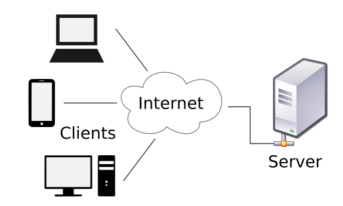

<style>
img {
    background: white;
}
</style>
## Asynchronous programming

**Quiz note:** Angular developers unfamiliar with<br>
`fetch(url).then(callback)` can treat it as<br>
`httpClient.get(url).subscribe(callback)`

### Warmup quiz 1

```js
fetch("https://api.stackexchange.com/2.3/questions/unanswered?pagesize=10&order=desc&sort=activity&site=stackoverflow")
.then(response => {
    console.log("A");
    crunchTheNumbers(response); // 10 seconds
    console.log("B");
});

fetch("https://api.stackexchange.com/2.3/questions/featured?pagesize=10&order=desc&sort=activity&site=stackoverflow")
.then(response => {
    console.log("C");
    crunchTheNumbers(response); // 10 seconds
    console.log("D");
});

console.log("E");
```

- HTTP roundtrip assumptions:
  - send HTTP request
  - 1000ms ± 500ms latency
  - receive HTTP response 200 OK
- Which `console.log` permutations can happen?
  - 30 reasonable options:

<input type="checkbox">ABCDE
<input type="checkbox">ABCED
<input type="checkbox">ABECD
<input type="checkbox">ACBDE
<input type="checkbox">ACBED
<input type="checkbox">ACDBE
<input type="checkbox">ACDEB
<input type="checkbox">ACEBD
<input type="checkbox">ACEDB
<input type="checkbox">AEBCD
<input type="checkbox">AECBD
<input type="checkbox">AECDB

<input type="checkbox">CABDE
<input type="checkbox">CABED
<input type="checkbox">CADBE
<input type="checkbox">CADEB
<input type="checkbox">CAEBD
<input type="checkbox">CAEDB
<input type="checkbox">CDABE
<input type="checkbox">CDAEB
<input type="checkbox">CDEAB
<input type="checkbox">CEABD
<input type="checkbox">CEADB
<input type="checkbox">CEDAB

<input type="checkbox">EABCD
<input type="checkbox">EACBD
<input type="checkbox">EACDB
<input type="checkbox">ECABD
<input type="checkbox">ECADB
<input type="checkbox">ECDAB

### Latency



- Client/Server communication has noticeable latency
  - Registers ≪ Cache ≪ Memory ≪ Disk ≪ Network
- Synchronous requests block control flow until response arrives:
  - ☕ `HttpResponse<String> response = httpClient.send(request, BodyHandlers.ofString());` 500ms
- Asynchronous requests let control flow progress immediately:
  - ☕ `CompletableFuture<HttpResponse<String>> future = httpClient.sendAsync(request, BodyHandlers.ofString());` 1ms

### Warmup quiz 2

```html
<input type="text"   id="title"    value="Nothing to see here!">

<input type="button" id="download" value="Download title">
```

<input type="text"   id="title"    value="Nothing to see here!">
<input type="button" id="download" value="Download title">

```js
document.getElementById("download").onclick = function () {

    document.getElementById("title").value = "Downloading question title...";

    fetch("https://api.stackexchange.com/2.3/search?order=desc&sort=activity&tagged=clojure&intitle=transducers&site=stackoverflow")
    .then(response => response.json())
    .then(questions => {
        document.getElementById("title").value = questions.items[0].title;
    });

    computeTheMandelbrotSet(); // 10 seconds
};
```

- Same HTTP roundtrip assumptions:
  - send HTTP request
  - 1000ms ± 500ms latency
  - receive HTTP response 200 OK
- What will `title` look like 5 seconds after clicking the `download` button?
  - 4 reasonable options:

<input type="checkbox">Nothing to see here!<br>
<input type="checkbox">Downloading question title...<br>
<input type="checkbox">Can someone explain Clojure Transducers to me in Simple terms?<br>
<input type="checkbox">*None of the above*

### Event Loop


- An infinite Event Loop executes JavaScript callbacks *sequentially* from a queue
  - Document is rendered between callbacks
  - Long-running callbacks freeze the UI
- The callback queue is populated *concurrently* by underlying Web APIs
  - Web APIs are implemented in C++ and achieve concurrency with C++ threads
  - But those C++ threads do *not* manifest in the JavaScript programming language itself!
  - JavaScript has no `Thread` class, memory model, race conditions, lost updates, deadlocks etc.

### ☕ Oversimplified implementation

```java
var queue = new java.util.concurrent.LinkedBlockingQueue<Runnable>();

void eventLoop() {
    while (true) {
        Runnable callback = queue.take();           // blocks if empty

        callback.run();

        Document.render();
    }
}


var httpClient = HttpClient.newHttpClient();

void httpGet(URI uri, BiConsumer<HttpResponse<String>, Exception> callback) {

    var request = HttpRequest.newBuilder().uri(uri).build();
    var future = httpClient.sendAsync(request, HttpResponse.BodyHandlers.ofString());

    future.whenComplete((response, error) -> {
        queue.add(() -> callback.accept(response, error)); // unblocks
    });
    // Audience: Why not simply  future.whenComplete(callback::accept);  ?
}
```

### Promise states

- pending
- settled
  - fulfilled
  - rejected

> A promise is [resolved](https://262.ecma-international.org/6.0/#sec-promise-objects)
> if it is settled or if it has been "locked in" to match the state of another promise.
>
> Attempting to resolve or reject a resolved promise has no effect.

### Node.js examples

```
C:\Users\fred\git\js\async\server> node 1995a.js

http://localhost:8080/Async.md
```
